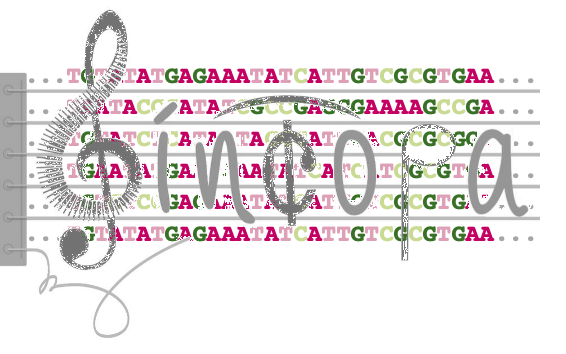

# <i>SINCOPA</i> https://sincopa.tau.ac.il/  <!-- width="50%" height="50%"> -->
Detecting selective sweeps in bacteria based on <i>S</i>imilarity of <i>INCO</i>ngruent <i>PA</i>tterns

The <i>SINCOPA</i> algorithm is the first ever phylogeny-based algorithm for paritial and soft selective sweeps detection that is tailored for bacterial data. <i>SINCOPA</i> is based on detecting similarity of incongruent allelic patterns in a given DNA multiple sequence alignment. <i>SINCOPA</i> is freely available to use through <a href="https://sincopa.tau.ac.il/" target="_blank"><i>SINCOPA</i> web server</a>. For further details see <a href="https://sincopa.tau.ac.il/overview.html" target="_blank"><i>SINCOPA</i>'s overview page</a>.

<!--
# Citation 
If you used <i>SINCOPA</i> please cite the following paper:

M1CR0B1AL1Z3R - a user-friendly web server for the analysis of large-scale microbial genomics data;

Oren Avram, Dana Rapoport, Shir Portugez, & Tal Pupko

Nucleic Acids Res, May 2019, DOI: https://doi.org/10.1093/nar/gkz423
-->
